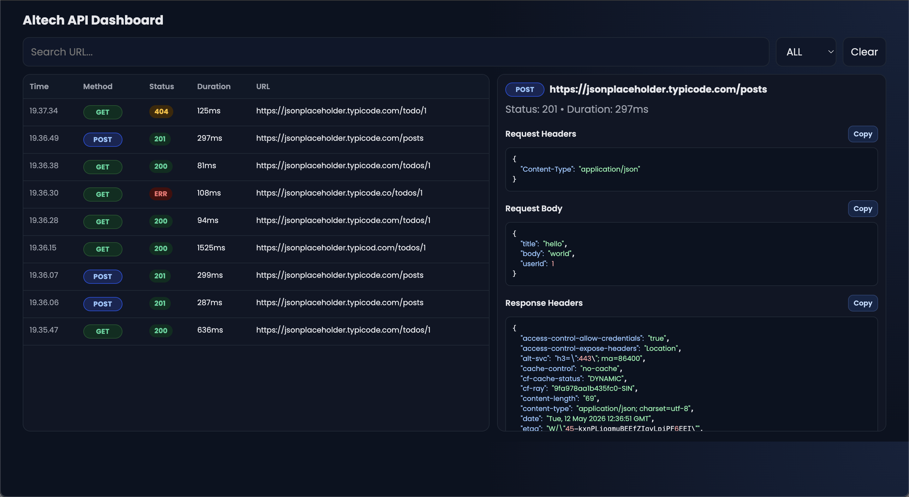

<p align="center">
  
</p>

# altech-run-api-inspector

`altech-run-api-inspector` is a React Native debugging package to inspect API traffic directly from your app runtime.

It helps teams debug `fetch` and `axios` requests without depending on Flipper, Reactotron, or extra native plugins.

## Why use this package

Most React Native API debugging workflows are fragmented:
- one tool for network logs
- another tool for request body/headers
- extra setup for emulator/device bridge

This package gives one focused workflow for API inspection with minimal setup and safe dev-only behavior.

## Main advantages

- Works in app runtime (`fetch` + `axios`)
- Dev-safe by default (`__DEV__` guard)
- Multiple output modes:
  - in-app overlay UI
  - Metro console
  - browser dashboard
- Request details ready for debugging:
  - method, URL, status, duration
  - request/response headers
  - request/response body
  - error message
- Productivity helpers:
  - search and status filter
  - clear logs
  - retry request
  - copy JSON
  - open URL in browser (absolute URL only)


## Dashboard preview

This is the current browser dashboard UI:



## What you can inspect

- `GET`, `POST`, `PUT`, `PATCH`, `DELETE`, and other HTTP methods
- Status groups with colors (`2xx`, `3xx`, `4xx`, `5xx`)
- Network errors (timeout/offline/server unreachable)
- JSON payloads with formatted output

## Choose your workflow

### 1) Browser dashboard (recommended for no-UI-trigger debugging)

Use this when you want logs in browser table view and do not want to open inspector from in-app floating button.

### 2) In-app overlay UI

Use this when you want to inspect requests directly inside the app screen (floating `API` button).

### 3) Console mode

Use this when you prefer terminal-first logs in Metro.

## Installation

```bash
npm install altech-run-api-inspector zustand @react-native-clipboard/clipboard
```

If your app uses Axios:

```bash
npm install axios
```

## Stage-by-stage setup (recommended)

This is the fastest setup for most teams.
The setup command is optional, but it is the easiest path for browser dashboard workflow.

### Step 1: Run auto setup

```bash
npx altech-api-inspector setup
```

This generates:
- `scripts/altech-api-inspector-dashboard.js`
- `scripts/altech-api-inspector-adb-reverse.js`
- `api-inspector.bootstrap.js`

And updates:
- app entry import (`import './api-inspector.bootstrap';`)
- `package.json` scripts:
  - `api-inspector:dashboard`
  - `api-inspector:reverse`
  - `api-inspector:start`
  - `api-inspector:dev`

Important:
- Generated bootstrap is configured for **dashboard-first flow**.
- It forwards logs to browser dashboard automatically.
- It does **not** require floating button trigger.
- It does **not** print full API payload logs to Metro terminal.

### Step 2: Install any newly added deps

```bash
npm install
```

### Step 3: Start dashboard + Metro

```bash
npm run api-inspector:dev
```

### Step 4: Run your app

```bash
npm run android
# or
npm run ios
```

### Step 5: Verify it works

In terminal, you should see something like:
- `[dashboard] running at http://localhost:3939`
- `[dashboard] received #1 GET 200 ...`

In browser dashboard, request rows should appear automatically when API calls happen.

This is already a dashboard-only workflow for daily use.

## Manual integration (without setup CLI)

Use this section only if you want custom behavior.
If you are happy with browser dashboard, you can keep using auto setup and skip manual mode configuration.

### In-app UI mode

```tsx
import { AltechApiInspector } from "altech-run-api-inspector";

export default function App() {
  return (
    <>
      <MainApp />
      {__DEV__ && <AltechApiInspector />}
    </>
  );
}
```

### Console-only mode (no floating button)

```tsx
import { useEffect } from "react";
import { initApiInspector } from "altech-run-api-inspector";

export default function App() {
  useEffect(() => {
    const cleanup = initApiInspector({
      mode: "console",
      maxLogs: 100,
      console: {
        verbosity: "compact",
        maxBodyLength: 800,
      },
    });

    return cleanup;
  }, []);

  return <MainApp />;
}
```

### Both UI + console

```tsx
<AltechApiInspector mode="both" />
```

### Axios integration

For default axios import:

```tsx
import axios from "axios";
import { attachAxiosInspector } from "altech-run-api-inspector";

if (__DEV__) {
  attachAxiosInspector(axios, { mode: "console" });
}
```

For custom axios instances (`axios.create`), call `attachAxiosInspector(instance)` for each instance.

## API reference

### `AltechApiInspector` props

```ts
type AltechApiInspectorProps = {
  enabled?: boolean;
  maxLogs?: number;
  position?: "bottom-right" | "bottom-left" | "top-right" | "top-left";
  defaultOpen?: boolean;
  allowOpenInBrowser?: boolean;
  allowCopy?: boolean;
  mode?: "ui" | "console" | "both";
  showFloatingButton?: boolean;
  console?: {
    maxBodyLength?: number;
    verbosity?: "compact" | "detailed";
    showHeaders?: boolean;
    showTimestamp?: boolean;
    onLog?: (log: ApiLog) => void | Promise<void>;
  };
};
```

Note:
- `mode` (`"ui" | "console" | "both"`) is relevant when you use component/manual integration directly.
- For auto setup dashboard flow, you usually do not need to touch `mode`.

Defaults:
- `enabled = __DEV__`
- `maxLogs = 100`
- `position = "bottom-right"`
- `defaultOpen = false`
- `allowOpenInBrowser = true`
- `allowCopy = true`
- `mode = "ui"`
- `showFloatingButton = true`

### `initApiInspector(options)`

```ts
type InitApiInspectorOptions = {
  enabled?: boolean;
  maxLogs?: number;
  mode?: "ui" | "console" | "both";
  interceptFetch?: boolean;
  console?: ConsoleLoggerOptions;
};
```

Default behavior:
- `enabled = __DEV__`
- `mode = "console"`
- `interceptFetch = true`

Returns cleanup function.

### Exported functions

- `AltechApiInspector`
- `initApiInspector(options?)`
- `attachFetchInspector(options?)`
- `restoreFetchInspector()`
- `isFetchInspectorAttached()`
- `attachAxiosInspector(axiosInstance, options?)`

## Browser dashboard behavior

When using setup CLI dashboard flow:
- dashboard starts at `3939` by default
- if port is busy, it auto-fallbacks to `3940`, `3941`, etc.
- app-side forwarding scans the same range
- method badges are colorized (`GET`, `POST`, `PUT`, `PATCH`, `DELETE`, etc.)
- JSON detail blocks support per-section copy buttons

Environment vars:
- `API_INSPECTOR_DASHBOARD_PORT` (default `3939`)
- `API_INSPECTOR_DASHBOARD_HOST`
- `API_INSPECTOR_DASHBOARD_SCAN` (default `20`)
- `API_INSPECTOR_DASHBOARD_TIMEOUT_MS` (default `700`)

## Troubleshooting

### Dashboard is empty

1. Ensure app actually sends requests.
2. Ensure dashboard terminal shows `[dashboard] received #...`.
3. Restart clean:

```bash
npx altech-api-inspector setup --force
pkill -f "altech-api-inspector-dashboard.js" || true
pkill -f "react-native.*start" || true
npm run api-inspector:dev
```

4. Hard refresh browser (`Cmd+Shift+R` on macOS).

### Port already in use (`EADDRINUSE`)

Kill old process or let dashboard fallback.

Check active ports:

```bash
lsof -nP -iTCP:3939 -sTCP:LISTEN
lsof -nP -iTCP:3940 -sTCP:LISTEN
```

### Android device/emulator cannot reach dashboard

- Emulator usually uses `10.0.2.2`.
- Physical Android requires `adb reverse`.
- `api-inspector:start` already runs reverse for `8081` and dashboard ports.

### Metro stuck at 70-90% bundle

Usually not an inspector issue. Wait until app is loaded and then trigger API calls.

## Security notes

- Development-only by design (`__DEV__` checks).
- No persistent storage by default (in-memory logs).
- Do not intentionally expose secrets in dev payloads if avoidable.
- Disable inspector in production builds.

## Dashboard layout notes

Dashboard includes:
- left panel: searchable request table (time, method, status, duration, URL)
- right panel: selected request details with copy buttons per section
- status and method color badges for quick scanning

## Roadmap

- Export/import logs
- HAR-like output support
- Optional request grouping
- Optional plugin hooks for custom transport targets


## License

MIT

## Links

- Repository: `https://github.com/Luxxn12/altech-run-api-inspector`
- Issues: `https://github.com/Luxxn12/altech-run-api-inspector/issues`

## Keywords

- react-native
- api-inspector
- network-inspector
- fetch-interceptor
- axios-interceptor
- debugging-tools
- devtools
- api-monitoring
- mobile-debugging
- altech